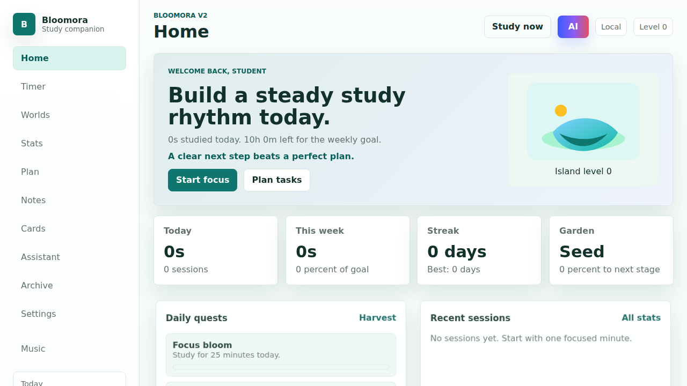
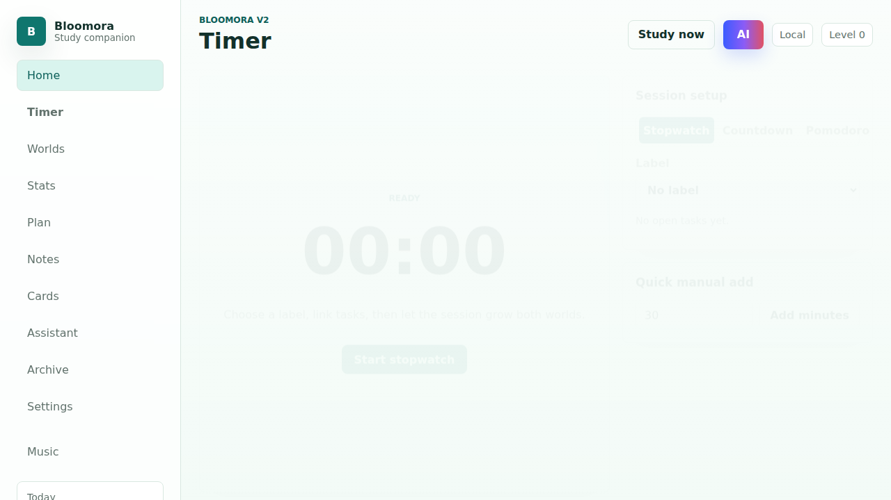
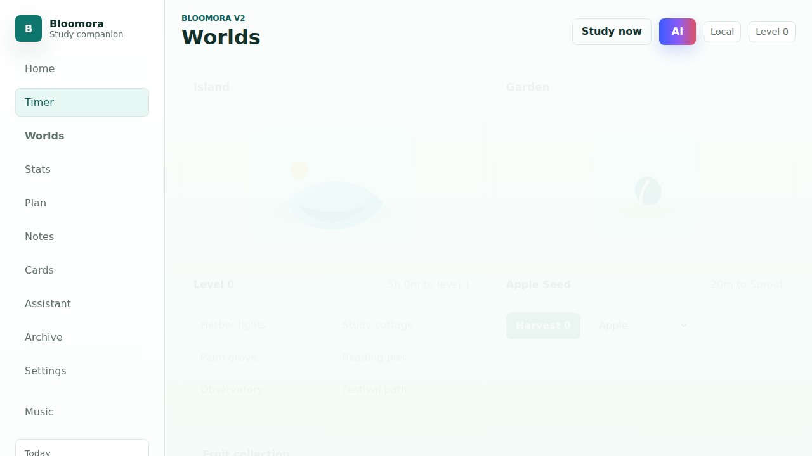
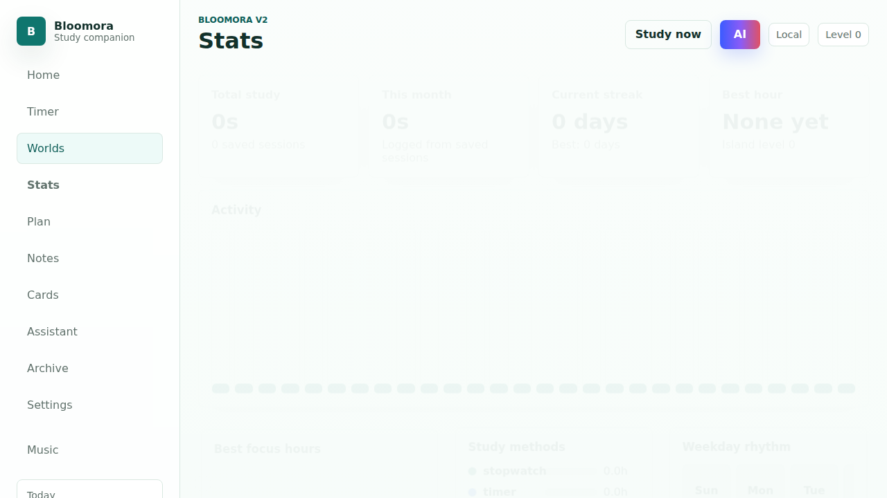
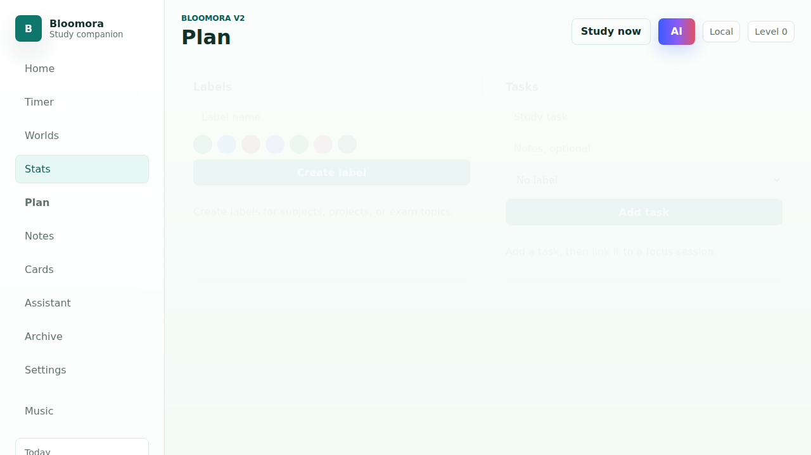
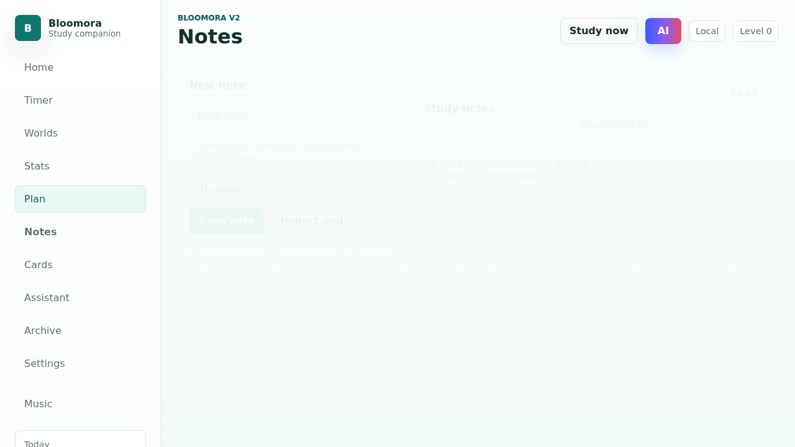
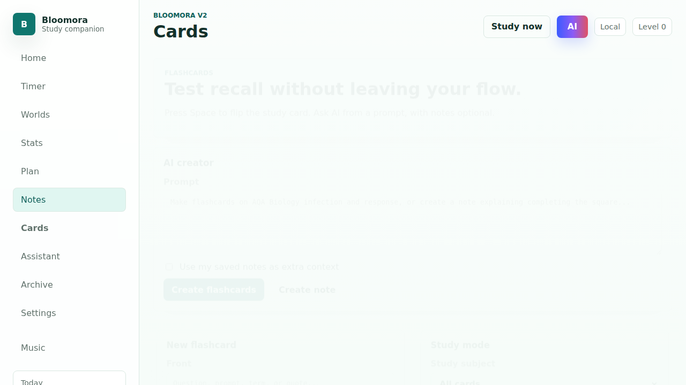
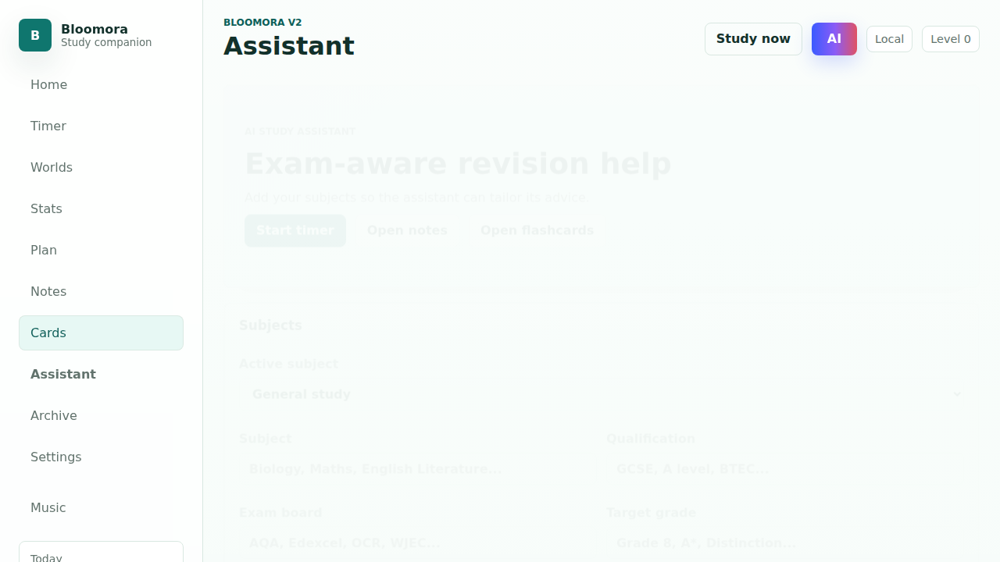
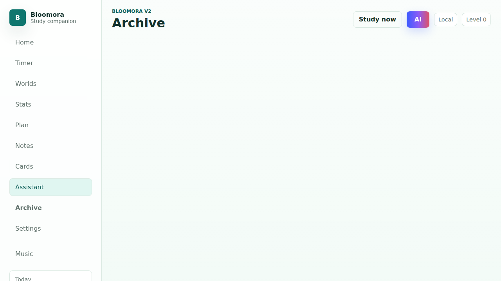
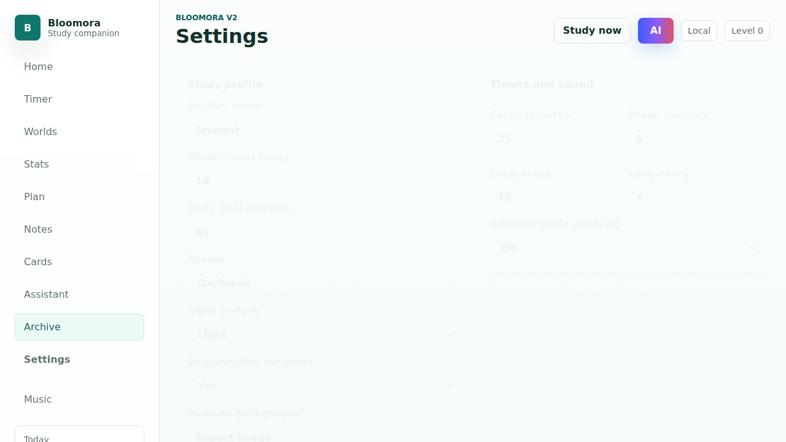

# Bloomora V2

Bloomora is a study tracker with a variety of features designed to enhance your productivity and help you achieve your learning goals.

You can access it at: **[https://bloomora.pages.dev](https://bloomora.pages.dev)**

## Features

- **Timers**: Pomodoro and study timers to stay focused.
- **Labels & Tasks**: Organize your study sessions and track your progress.
- **Notes & Flashcards**: Built-in support for capturing knowledge and reviewing it via flashcards.
- **Study Assistant**: A built-in AI assistant to help you with your studies.
- **Stats**: Detailed statistics to review your performance and track your growth.
- **Worlds Progression**: Gamified island/garden progression, quests, and achievements to keep you motivated.
- **Audio Ambience**: Ambient sounds (fire, nature, sea, wind) and LoFi music to create a focused atmosphere.
- **Data Management**: Backup import/export functionality to keep your data safe, along with optional syncing capabilities.

## Screenshots

### Home / Dashboard

### Timer

### Worlds

### Stats

### Plan

### Notes

### Flashcards

### Assistant

### Archive

### Settings

