# Bloomora

Bloomora is a study planner and tracker for sixth form, college and university students. It works offline in your browser, with optional account sync across devices.

You can access it at: **[https://bloomora.pages.dev](https://bloomora.pages.dev)**

## Features

- **Overview**: Today's progress against your goals, upcoming deadlines and tasks, today's classes, exam countdowns and recent sessions.
- **Focus timer**: Pomodoro, countdown and stopwatch modes, with a note for each session and manual logging for past study.
- **Tasks**: Due dates, priorities and labels, grouped into overdue, today, the next 7 days and later.
- **Deadlines**: Track assignments, coursework, presentations and exams with their weighting and status (not started, in progress, submitted).
- **Timetable**: Add classes by hand or import a spreadsheet. Today's column is highlighted.
- **Subjects / modules**: Qualification, exam board, target grade and exam date for each subject. The wording changes to "modules" for university students.
- **Notes**: Markdown notes with write, split and preview modes, search, labels, `.md` import and export.
- **Flashcards**: Spaced repetition review (Again / Hard / Good / Easy) with due counts, a practice mode, a searchable card browser and AI-generated cards.
- **AI tutor**: A chat that knows your stage of study, active subject, notes, tasks and deadlines. Replies can be saved as notes.
- **Insights**: Daily study time against your goal, time of day, day of week, study method, time by label and CSV export.
- **Grades**: Record marks with optional weighting to get weighted averages per subject. University and postgraduate students also see UK degree classifications.
- **Profile and account**: A profile menu in the top right with an uploadable avatar, plus sign in, sync, theme and settings. Sign-in forms only appear in a dialog when you ask for one.
- **Search**: Press <kbd>Ctrl</kbd>/<kbd>⌘</kbd> + <kbd>K</kbd> to jump to any page, note, task, deadline or flashcard.
- **Appearance**: Light and dark modes, four accent colours, an optional background image and a compact sidebar. Pages you don't use can be hidden.
- **Data**: Everything is stored locally first. You can export and restore JSON backups, and sync through Supabase is optional.

## Screenshots

### Overview
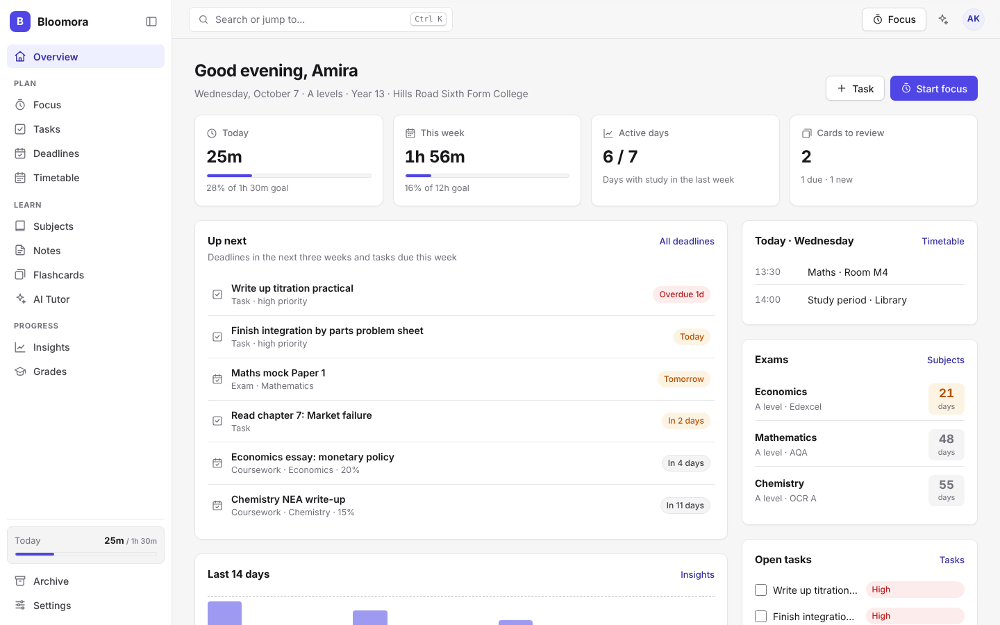

### Overview (dark mode)
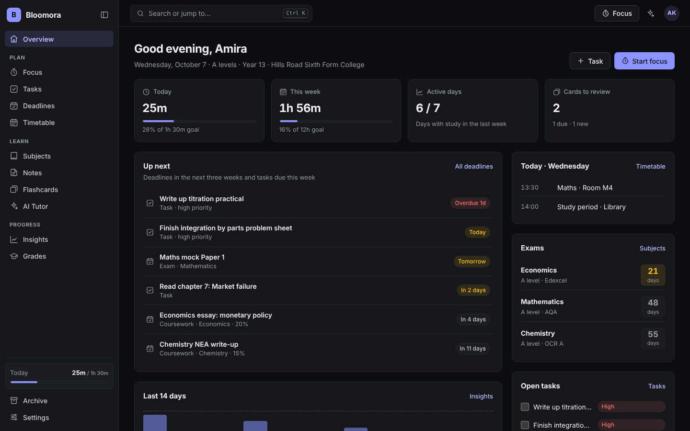

### Focus
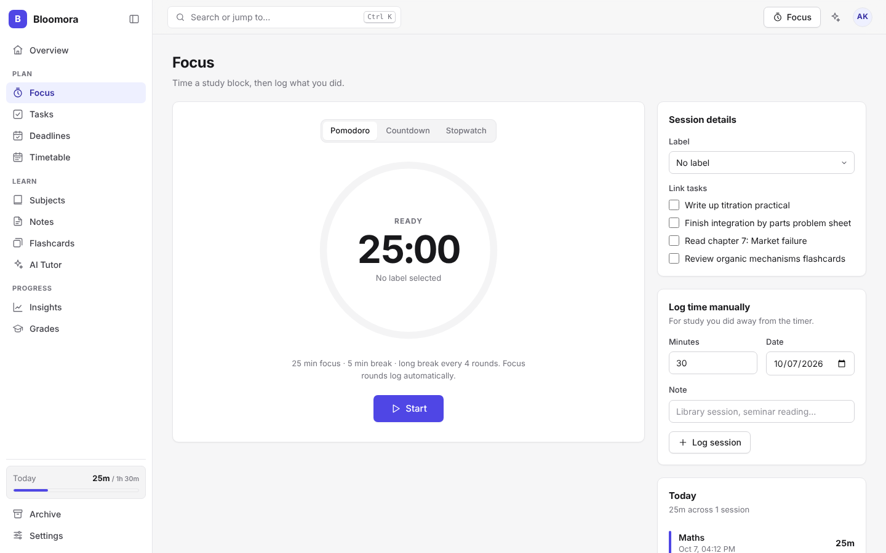

### Tasks
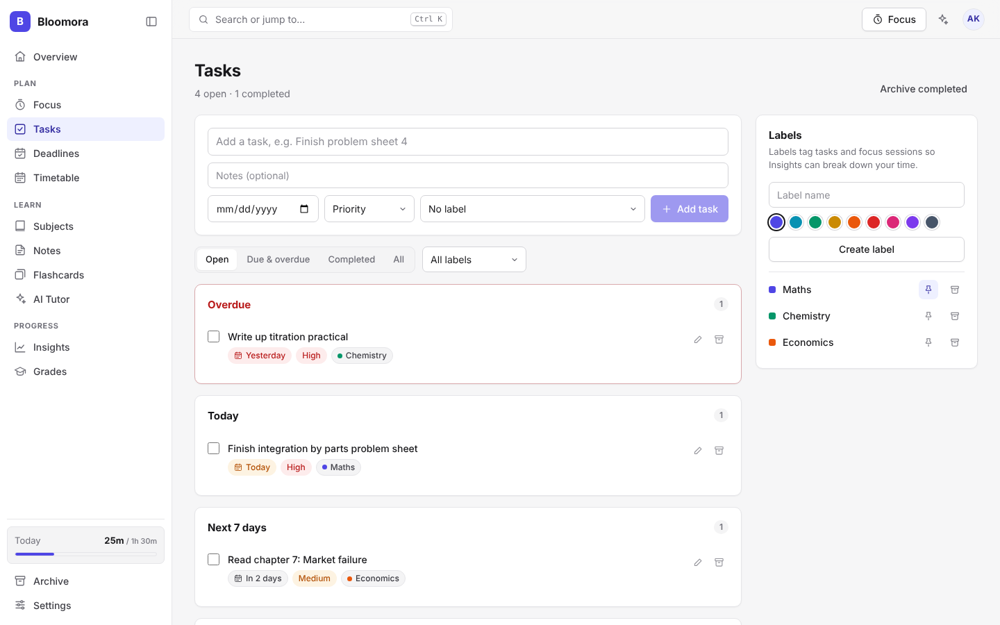

### Deadlines
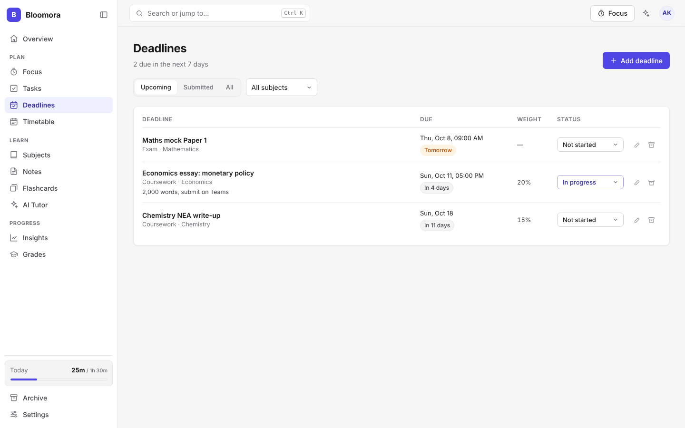

### Timetable
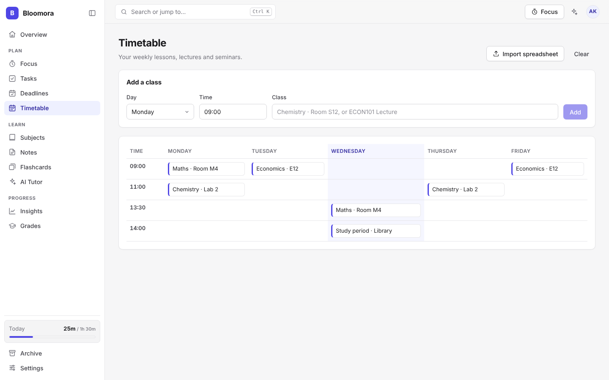

### Notes
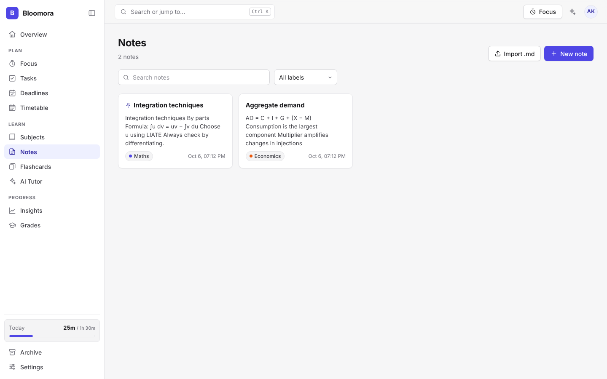

### Flashcards
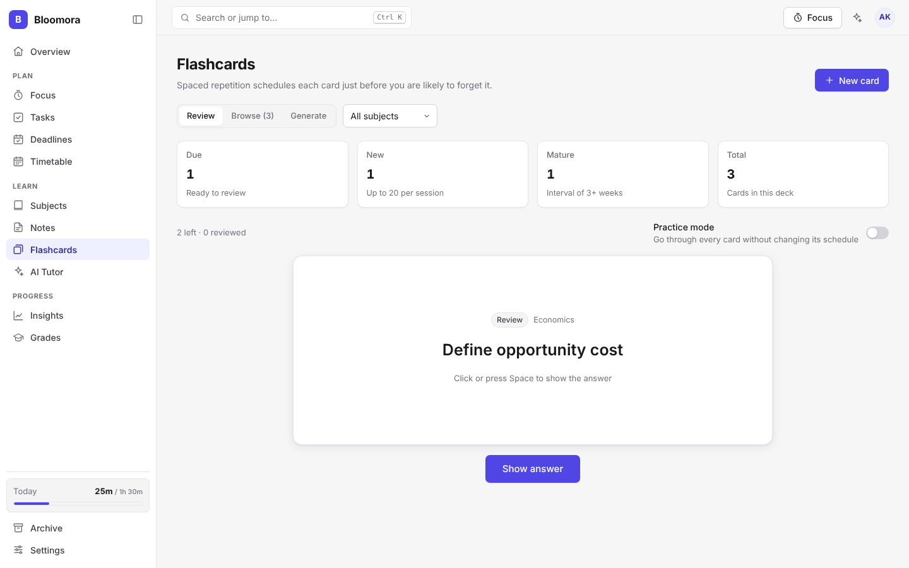

### Insights
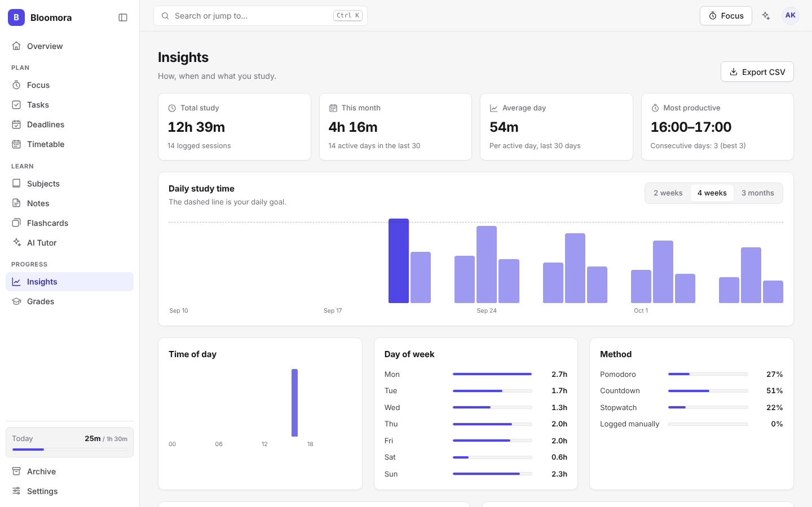

### Grades
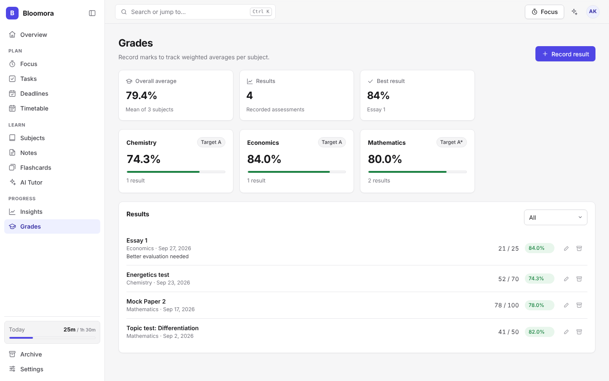

### Settings
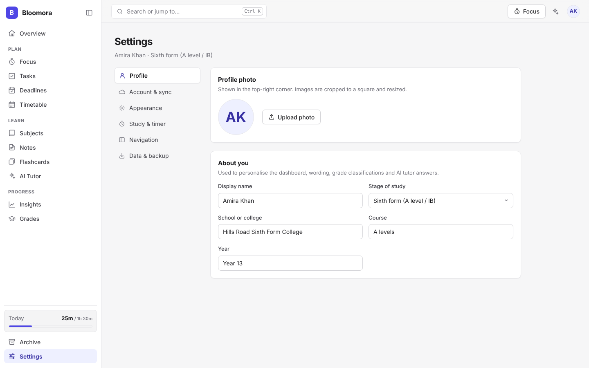

## Development

```bash
npm install
npm run dev        # http://127.0.0.1:5173
npm test           # unit tests (Vitest)
npm run test:e2e   # browser tests (Playwright)
npm run build
```

Optional environment variables (see `.env.example`):

- `VITE_SUPABASE_URL` and `VITE_SUPABASE_ANON_KEY` turn on accounts and cloud sync. Run `supabase_schema_v2.sql` in the Supabase SQL editor to create or upgrade the tables. Projects that have not yet run the newest schema keep syncing their core data, but deadlines and grades stay on the device until they do.
- `OPENROUTER_API_KEY`, `OPENROUTER_MODEL` and `VITE_API_AUTH_TOKEN` (with `API_AUTH_TOKEN` on Cloudflare Pages) turn on the AI tutor.
